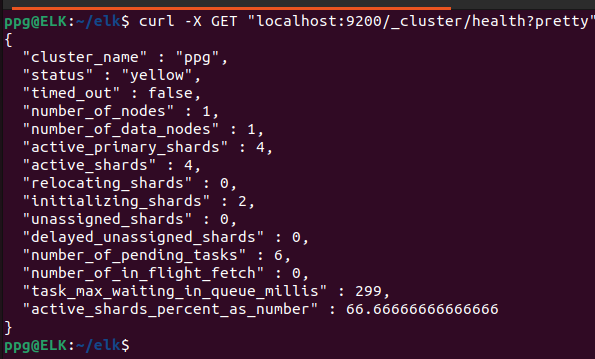
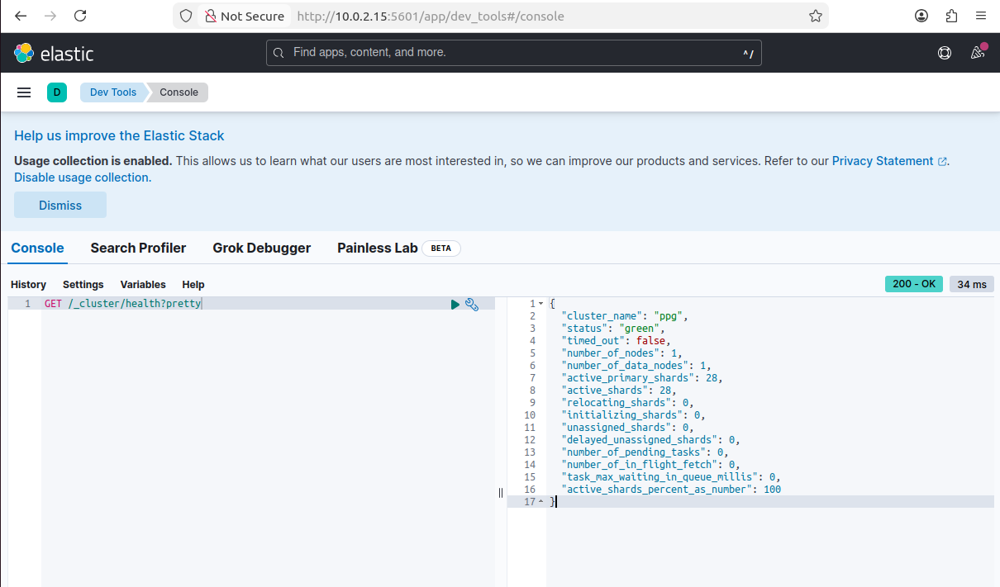
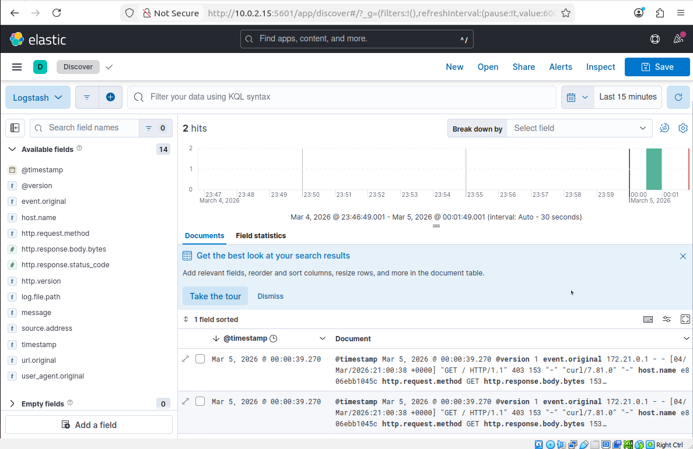
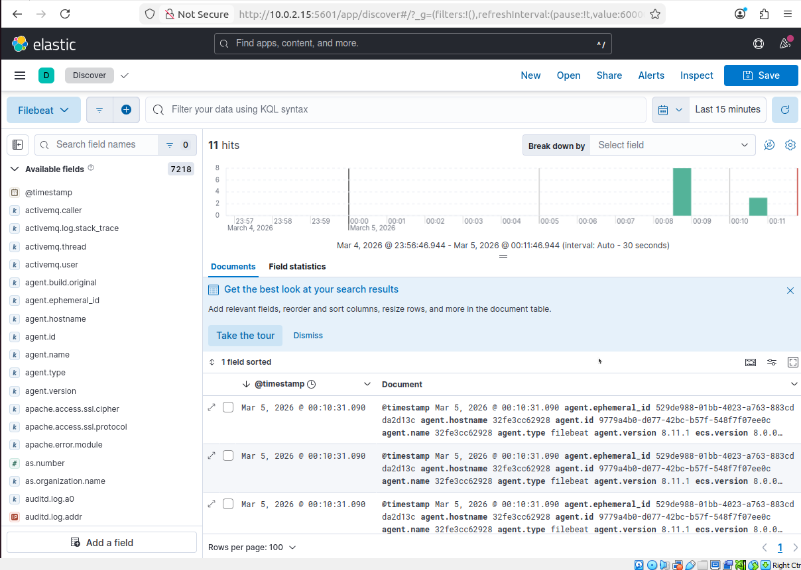

# Домашнее задание к занятию «ELK» - Петр Петров

### Задание 1. Elasticsearch  
Установите и запустите Elasticsearch, после чего поменяйте параметр cluster_name на случайный.  

*Приведите скриншот команды 'curl -X GET 'localhost:9200/_cluster/health?pretty', сделанной на сервере с установленным Elasticsearch. Где будет виден нестандартный cluster_name.*  

### Решение 1.
Был установлен и запущен Elasticsearch в Docker-контейнере 
[Файл elasticsearch.yml](./elasticsearch/elasticsearch.yml).  
[Файл docker-compose.yml](./docker-compose.yml)
Параметр cluster_name был изменён на **ppg**.  
скриншот команды 'curl -X GET 'localhost:9200/_cluster/health?pretty  
  

Получен ответ со статусом yellow и нестандартным именем кластера - ppg.
### Задание 2. Kibana
Установите и запустите Kibana.  

*Приведите скриншот интерфейса Kibana на странице http://<ip вашего сервера>:5601/app/dev_tools#/console, где будет выполнен запрос GET /_cluster/health?pretty.*  

### Решение 2.
Была установлена и запущена Kibana для визуализации данных Elasticsearch.  
[Файл docker-compose.yml](./docker-compose.yml)  

Обеспечивает подключение Kibana к Elasticsearch и доступ к веб-интерфейсу.  
В интерфейсе Kibana по адресу: http://10.0.2.15:5601 в разделе Dev Tools → Console был выполнен запрос:  

`GET /_cluster/health?pretty`  
Скриншот интерфейса Kibana с выполненным запросом:  

  

### Задание 3. Logstash
Установите и запустите Logstash и Nginx. С помощью Logstash отправьте access-лог Nginx в Elasticsearch.  

*Приведите скриншот интерфейса Kibana, на котором видны логи Nginx.*  

### Решение 3.
Были установлены и запущены Nginx и Logstash.  
С помощью Logstash настроена передача access-логов Nginx в Elasticsearch.  
[Файл logstash.conf](./logstash/config/logstash.conf)  
В Kibana в разделе Discover отображаются логи Nginx с индексом nginx-logs-*  
  

### Задание 4. Filebeat.

Установите и запустите Filebeat. Переключите поставку логов Nginx с Logstash на Filebeat.  

*Приведите скриншот интерфейса Kibana, на котором видны логи Nginx, которые были отправлены через Filebeat.*  

### Решение 4.
Filebeat был установлен и настроен для доставки логов Nginx напрямую в Elasticsearch.  
Передача логов через Logstash была отключена.  
[Файл filebeat.yml](./filebeat/filebeat.yml)  

В Kibana в разделе Discover отображаются логи Nginx в индексе: filebeat-*  
  

Вывод:  
В ходе выполнения работы был развёрнут стек Elastic с использованием Docker Compose.  
Настроена централизованная система сбора, обработки и визуализации логов веб-сервера Nginx.  

В результате:  
- Elasticsearch обеспечивает хранение данных  
- Kibana используется для анализа и визуализации  
- Logstash применялся для обработки логов  
- Filebeat реализует лёгкую и эффективную доставку логов напрямую в Elasticsearch  
